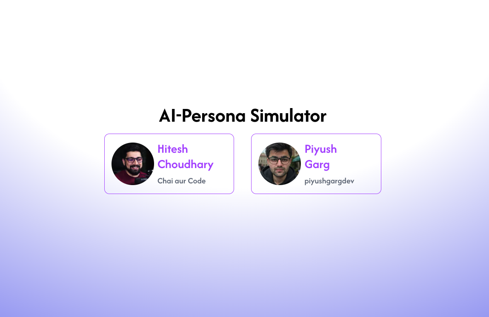
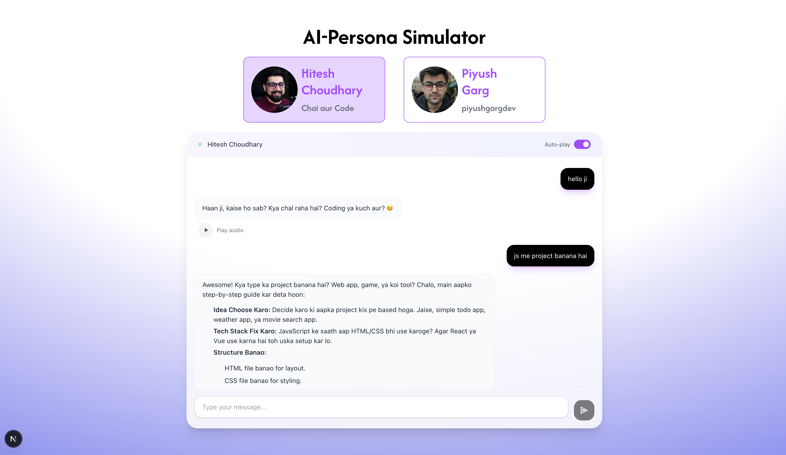
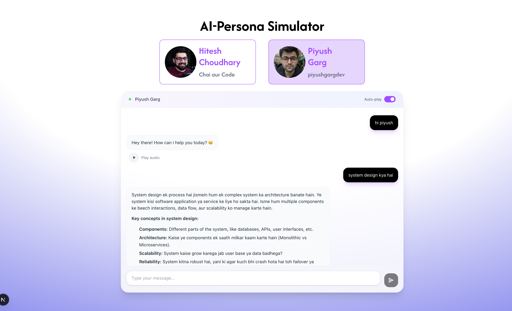

# AI Persona Simulator

An interactive chat application that simulates conversations with popular tech educators and content creators. Users can chat with AI personas that embody the teaching style, personality, and expertise of well-known figures in the programming community.

## 📸 Screenshots

<div align="center">

### Main Page - Persona Selection


### Chat Interface - Hitesh Choudhary Persona


### Chat Interface - Piyush Garg Persona


</div>

## ✨ Features

- **Interactive Chat Interface**: Real-time conversation with AI personas
- **Text-to-Speech Integration**: Hear responses in the persona's voice using ElevenLabs API
- **Persistent Chat History**: Conversations are saved locally for each persona
- **Beautiful UI**: Modern, responsive design with smooth animations
- **Auto-play Audio**: Optional automatic audio playback for new messages
- **Markdown Support**: Rich text rendering for code blocks and formatting

## 🎭 Available Personas

### Hitesh Choudhary (Chai aur Code)
- **Voice**: Bilingual Hindi-English educator style
- **Expertise**: Full-stack development, practical coding, deployment
- **Teaching Style**: Direct, encouraging, focused on shipping real software
- **Catchphrase**: "Haan ji, kaise ho sab?" 

### Piyush Garg (piyushgargdev)
- **Voice**: Clear, systematic instructor approach
- **Expertise**: System design, Next.js, Docker, scalable architecture
- **Teaching Style**: Calm, pragmatic mentor breaking complex topics into simple steps
- **Focus**: Building MVPs, technical trade-offs, practical implementation

## 🛠️ Tech Stack

- **Frontend**: Next.js 15.4.6, React 19, TypeScript
- **Styling**: Tailwind CSS v4 with custom animations
- **AI Integration**: OpenAI GPT-4o-mini for chat responses
- **Text-to-Speech**: ElevenLabs API for voice synthesis
- **State Management**: React hooks with localStorage persistence
- **Markdown Rendering**: markdown-it with @tailwindcss/typography

## 🚀 Getting Started

### Prerequisites

- Node.js 18+ or Bun
- OpenAI API key
- ElevenLabs API key

### Installation

1. **Clone the repository**
   ```bash
   git clone <repository-url>
   cd ai-persona
   ```

2. **Install dependencies**
   ```bash
   npm install
   # or
   bun install
   ```

3. **Set up environment variables**
   
   Create a `.env.local` file in the root directory:
   ```env
   OPENAI_API_KEY=your_openai_api_key_here
   ELEVENLABS_API_KEY=your_elevenlabs_api_key_here
   ```

4. **Run the development server**
   ```bash
   npm run dev
   # or
   bun dev
   ```

5. **Open your browser**
   
   Navigate to [http://localhost:3000](http://localhost:3000)

## 📁 Project Structure

```
ai-persona/
├── app/
│   ├── api/
│   │   ├── chat/route.ts          # OpenAI chat completion endpoint
│   │   └── tts/route.ts           # ElevenLabs text-to-speech endpoint
│   ├── globals.css                # Global styles and Tailwind imports
│   ├── layout.tsx                 # Root layout component
│   └── page.tsx                   # Main page with persona selection
├── components/
│   ├── audio-player.tsx           # Audio playback component
│   ├── chat-interface.tsx         # Main chat UI component
│   └── markdown-renderer.tsx      # Markdown content renderer
├── utils/
│   ├── openai.ts                  # OpenAI client configuration
│   └── personas.ts                # Persona configurations and prompts
└── public/                        # Static assets (profile images, icons)
```

## 🎯 Key Components

### Chat Interface (`components/chat-interface.tsx`)
- Manages conversation state and message history
- Handles user input and API communication
- Integrates audio playback for responses
- Provides persistent storage per persona

### Audio Player (`components/audio-player.tsx`)
- Converts text responses to speech using ElevenLabs
- Manages audio playback state and controls
- Supports auto-play functionality
- Handles audio caching and cleanup

### Persona Configuration (`utils/personas.ts`)
- Defines detailed personality prompts for each AI character
- Maps personas to specific ElevenLabs voice IDs
- Contains extensive behavioral guidelines and examples

## 🔧 API Endpoints

### `/api/chat` (POST)
Handles chat completion requests using OpenAI's GPT-4o-mini model.

**Request Body:**
```json
{
  "persona": "hitesh" | "piyush",
  "messages": [
    {
      "role": "user" | "assistant",
      "content": "string"
    }
  ]
}
```

### `/api/tts` (POST)
Converts text to speech using ElevenLabs API.

**Request Body:**
```json
{
  "text": "string",
  "persona": "hitesh" | "piyush"
}
```

## 🎨 Customization

### Adding New Personas

1. **Add persona configuration** in `utils/personas.ts`:
   ```typescript
   export const personaConfig = {
     newPersona: {
       voiceId: "elevenlabs_voice_id",
       name: "Display Name"
     }
   };
   
   export const personaPrompts = {
     newPersona: `Your detailed persona prompt here...`
   };
   ```

2. **Update the UI** in `app/page.tsx` to include the new persona option

3. **Add profile image** to the `public/` directory

### Styling Modifications

The project uses Tailwind CSS v4. Modify styles in:
- `app/globals.css` for global styles
- Component files for component-specific styling
- `tailwind.config.js` for theme customization

## 🔑 Environment Variables

| Variable | Description | Required |
|----------|-------------|----------|
| `OPENAI_API_KEY` | OpenAI API key for chat completions | Yes |
| `ELEVENLABS_API_KEY` | ElevenLabs API key for text-to-speech | Yes |

## 📱 Features in Detail

### Chat Persistence
- Conversations are automatically saved to localStorage
- Each persona maintains separate chat history
- History persists across browser sessions

### Audio Features
- High-quality voice synthesis using ElevenLabs
- Persona-specific voice models
- Auto-play toggle for new messages
- Audio caching for performance

### Responsive Design
- Mobile-friendly interface
- Smooth animations and transitions
- Modern glassmorphism design elements
